# 目录
[TOC]
# 第一章 Linux系统编程入门

## 1.GCC
### 1.1 GCC 是什么
`gcc` 一个编译器套件，其包含有各种语言的编译器和依赖的库文件
### 1.2 GCC 如何使用
```
gcc test.c -o app

```
使用gcc对test.c进行编译，可执行文件命名为app（格式为.out）

### 1.3 GCC工作流程

**预处理阶段**
宏展开
清除注释
展开头文件
- .c -> .i

**编译阶段**
- .i -> .s

**汇编阶段**
- .s -> .o

**链接**
- .o -> .a/.exe

### 1.4 GCC和G++的区别
预处理、编译、汇编阶段，都是使用GCC来完成的，即使使用G++，也会调用GCC来完成，而到了链接阶段，因为GCC不包含部分C++的库文件，所以，这一部分还是由G++来完成。

### 1.5 GCC常用选项

| GCC编译选项 | 选项的含义 |
| --- | --- |
| -E | 预处理 |
| -S | 预处理、编译 |
| -c | 预处理、编译、汇编 |
| -o | 指定最终的文件名（不只是可执行文件） |
| -g | 调试 |
| -D | 编译时指定一个宏 |
| -w | 不生成警告信息 |
| -Wall | 生成所有警告信息 |
|-On|优化编译器的等级，n = 0 , 3|
|-l|指定编译时的用到的库文件名|
|-L|指定库文件的路径|
|-g|在可执行文件中加入源文件信息，如行号|
|-std|指定c语言的标准|

### 1.6 库文件
库指的是库文件、库文件本质上是一段程序，但是不能单独运行
#### 1.6.1 静态库文件
**命名规则：**
Linux：libxxx.a
Windows:libxxx.lib
xx:库名

**静态库制作流程**

1. 生成目标文件.o(gcc -c)
2. `ar rcs libxx.a xx.o xx.o`
    1. ar : archive工具
    2. r：将xx.o插入到静态库文件
    3. s:加入索引（便于搜索）

**静态库文件的使用**
`gcc main.c -o app -I ./include -l calc -L./lib/`

1. 使用gcc 对main.c文件进行预处理、编译、汇编、链接
2. 生成的可执行文件命名为app
3. 指定头文件地址为本目录下的include目录
4. 指定依赖的库名称为calc
5. 指定依赖库所在目录的绝对路径为本目录下的lib目录

#### 1.6.2 动态库文件
**动态库文件命名规则**
Linux：libxxx.so
Windows:libxxx.dll
xx:库名

**动态库的制作**

1. `gcc -c -fpic/-fPIC a.c b.c`
    1. 通过gcc -c命令生成目标文件.o文件
    2. -fpic/-fPIC选项指定库文件和位置无关？？？
    3. a.c 、b.c指的是源文件
2. `gcc -shared a.o b.o -o libcalc.so`
    1. 使用gcc将.o文件转化成动态库文件
    2. -shared 动态库文件选项（动态库也称为共享库）
    3. a.o 、 b.o ：目标文件
    4. -o libxx.so 命名

**动态库的使用**

1. `gcc main.c -o main -I ./include -L ./lib/ -l calc`
    1. 使用gcc对源文件进行预处理、编译、汇编、链接
    2. 可执行文件命名为main
    3. 头文件目录在本目录下的include目录
    4. 库文件所在路径为本本目录下的lin目录
    5. 库名字为calc
    6. 这一步的操作使得可执行文件包含了动态库的基本信息，即需要用到libcalc.so的动态库文件，但执行时，**需要从专门的路径寻找动态库文件**
2. 寻找动态库文件的过程
    1. 系统会提供一个**动态载入器**将动态库文件载入到内存中，如ld-linux.so,会依次从下面的位置寻找动态库libcalc.so，然后加载到内存
        1. elf文件的DT_RPATH段
        2. 环境变量的LD_LIBRARY_PATH
        3. /etc/ld.so.chache文件列表
        4. /lib/目录
        5. /usr/lib目录
    2. 所以，为了告诉系统，动态库在哪里，我们可以任选一种下面的操作
        1. 在环境变量LD_LIBRARY_PATH下添加动态库的绝对路径
            1. `export LD_LIBRARY_PATH=$LD_LIBRARY_PATH:/root/Linux/lesson06/library/lib`
                1. export 添加
                2. $原有环境变量的值
                3. 整个语句意思是在原有绝对路径的基础上添加一条，中间用：隔开
                4. 使用该种方法添加的环境变量当重启客户端连接之后会消失，是一种临时性的配置
            2. 用户级环境变量配置
                1. 用户级目录下 有一个 .bashrc文件
                2. 使用 vim 打开
                3. 添加代码
                4. `export LD_LIBRARY_PATH=$LD_LIBRARY_PATH:/root/Linux/lesson06/library/lib`
                5. 刷新.bashrc文件. .bashrc 或者 source .bashrc
            3. 系统级别环境配置
                1. sudo vim /etc/profile
                    1. sudo 取得权限
                    2. vim 打开文件
                    3. /tec/profile 根目录下的文件（/这个符号是根目录的意思）
                2. 刷新：. /etc/profile 或者 source /etc/profile
        2. 在 /etc/ld.so.chache添加绝对路径
            1. 该文件为二进制文件，不能直接修改，可通过在/etc/ld.so.conf中配置实现
                1. sudo vim /etc/ld.so.conf
                    1. sodo 权限
                    2. vim打开文件
                2. 将库文件所在 目录的绝对路径粘贴到文件中
                3. 刷新 sudo ldconfig
        3. 在/lib目录下直接添加库文件
            1. 不推荐，会造成包污染
        4. 在/usr/lib下直接添加库文件
            1. 不推荐，会造成包污染
### 1.7 用到的一些shell命令
|shell命令|作用|
|---|---|
|ldd|查看可执行文件的依赖库|
|pwd|查看当前目录的绝对路径|
|ls|列表形式展开当前目录下的所有文件和目录|
|env|查看系统环境变量
|vim|使用vim编辑文件|
|echo|查看当前
|touch|修改文件或者目录的时间属性，若文件不存在，系统会建立一个新的文件|
|clear|清空前面所有的命令行信息|
|~|当前登录用户的用户目录|
|/|根目录|
|./|当前目录|
|..|上级目录|

### 1.8 vim 操作
|vim命令|命令含义|
|---|---|
|按i|切换到插入模式|
|按o|切换到插入模式|
|按esc|退出插入模式|
|:q|退出|
|:wq|保存并退出|
|:set nu|显示行号|

### 1.9 一些疑问

1. -fpic参数
    1. -fPIC 作用于编译阶段，告诉编译器产生与位置无关代码(Position-Independent Code)，  则产生的代码中，没有绝对地址，全部使用相对地址，故而**代码**可以被**加载器**加载到**内存**的**任意位置**，都可以正确的执行。这正是**共享库所要求**的，共享库被加载时，在内存的位置不是固定的。

## 2.Makefile
### 2.1 Makefile是什么？

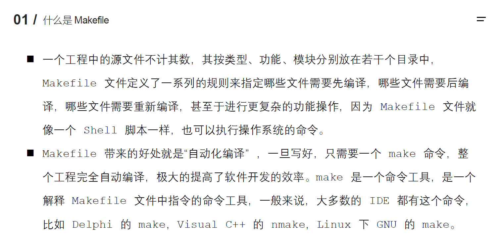

>Makefile 本质是一个**文件**
>该文件中定义了一系列**规则**
>这些规则定义了**哪些文件**应该**如何被编译**以及编译成**什么文件**
>Makefile文件由**make软件**读取并执行

### 2.2 Makefile文件命名和规则
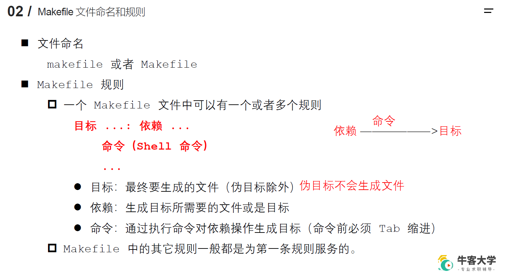

### 2.3 Makefile工作原理


### 2.4 Makefile中的变量
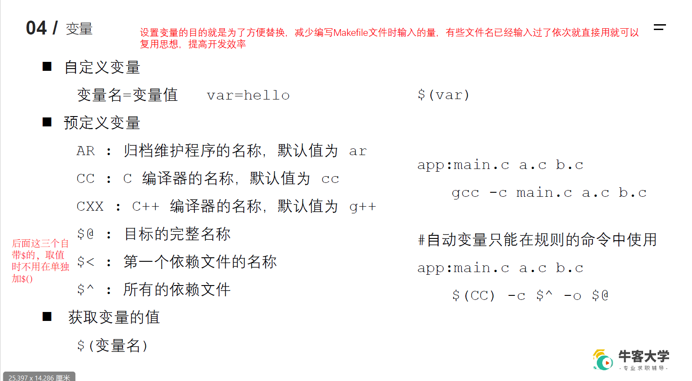

### 2.5 Makefile中的模式匹配
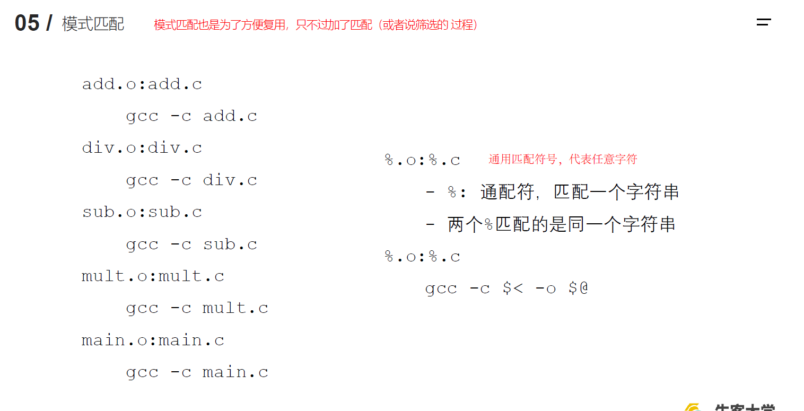

### 2.6 Makefile中的函数
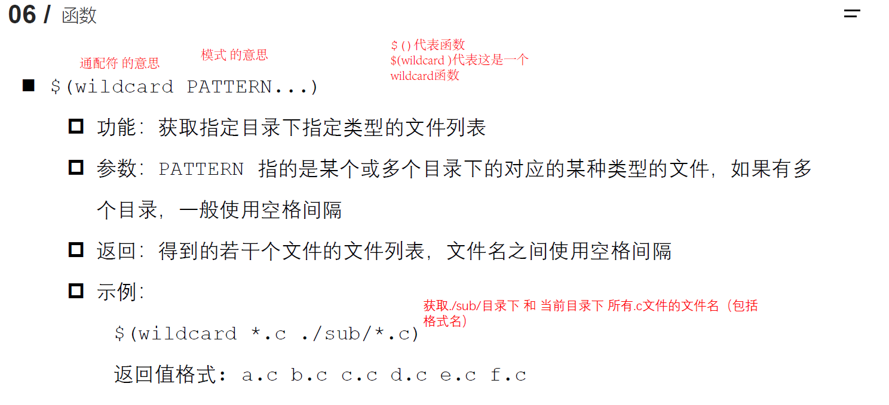

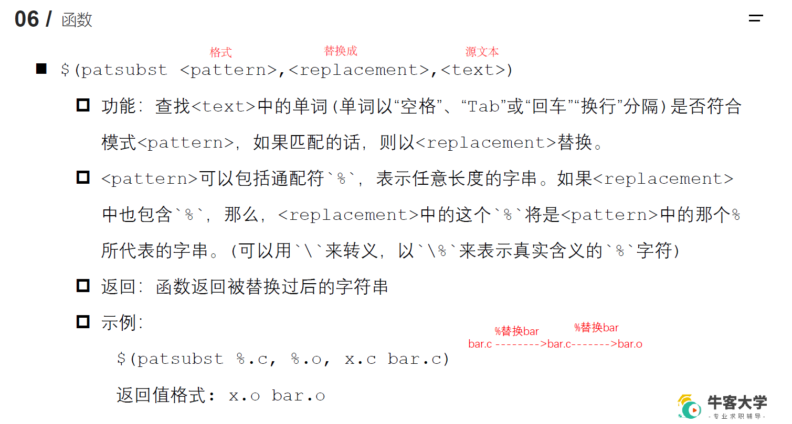

## 3.GDB
### 3.1 GDB是什么？


|GDB命令|命令含义|
|---|---|
|quit|退出GDB|
|set args 10 20|为可执行程序设置参数|
|show args|显示参数|
|help|显示帮助菜单|


>注意：源文件和可执行文件要放在同一目录下，否则GDB无法正常工作（如显示第一行代码,可执行文件并不携带代码原文）


### 3.2 GDB调试的准备工作
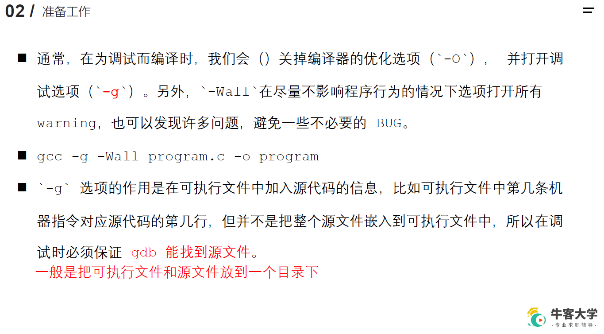

### 3.3 GDB的使用——启动、退出、查看源码
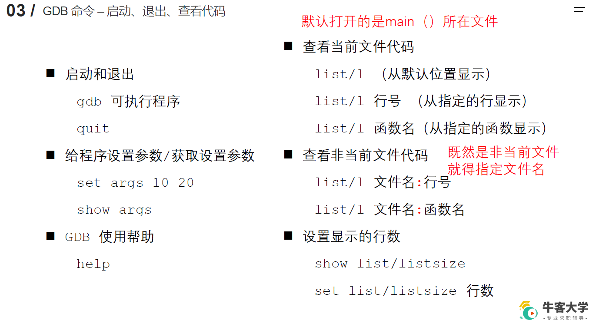

### 3.4 GDB的使用——断点
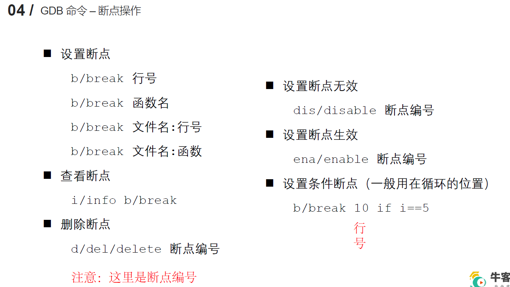

### 3.5 GDB的使用——调试命令


* * *
```
调试命令汇总
```
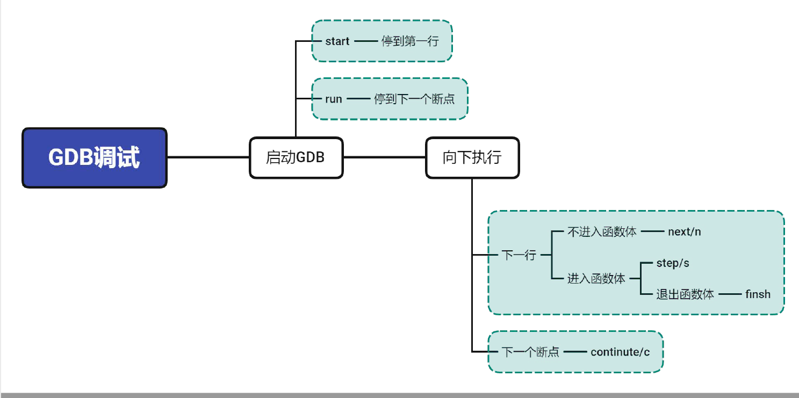

* * *


* * *

## 4.文件IO
### 4.1 标准C库IO函数和Linux系统IO函数

### 4.2 虚拟地址空间
>以32位操作系统为例，一个虚拟地址空间0-3G为用户区域，3-4G为内核区
>虚拟地址空间和真实地址空间的映射由CPU的**MMU**（内存管理单元）来实现，依赖的技术叫虚拟内存管理技术
>4G是理论上最大的需要的空间大小


受保护的地址：如null、nullptr段

text段：代码段，可执行文件的代码对应的机器指令放到这里
.data段：已初始化的全局变量放在这里
.bss段：未初始化的全局变量放在这里
堆空间：new 、 malloc，从低地址向高地址存
共享库：shared lib（动态链接库）放到这里
栈：（比堆空间小，从高地址 向 低地址存）
命令行参数：
环境变量：

### 4.3 文件描述符
进程：正在运行的程序，操作系统会为每个进程创建一份虚拟地址空间，理论上最大为4G，为了使进程能够加载文件，进程的虚拟地址空间的-》Linux kernel 里的 -》 PCB控制块里设置有一个**文件描述符表**，这个表用来存放文件描述符，在内存中，一个文件描述符对应一个文件（磁盘里的一个文件可能对应内存中的多个文件，也就对应着多个文件描述符）
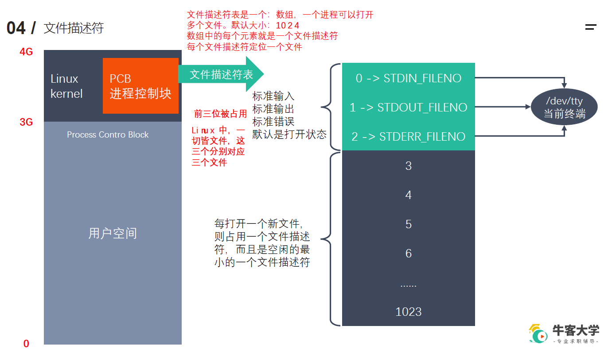

### 4.4 一些函数
#### 4.4.1 IO相关函数
**两个open函数**
`
int open(const char *pathname, int flags);
`

```
//打开一个存在的文件

参数：    
    - path：路径
    - flags：权限等设置
        必选项:O_RDONLY, O_WRONLY, or O_RDWR
        可选项:O_APPEND
返回值：
    一个新的文件描述符，或者-1（如果失败的话），并会给errno赋值
errno属于Linux系统函数库，是库里面的一个全局变量，记录的是最近的错误号
    perror(“user error data”)函数可以打印user error data ：xxx 错误信息

```
`
int open(const char *pathname, int flags, mode_t mode);
`

```

//创建一个新文件
int open(const char *pathname, int flags, mode_t mode);
参数：    
    - path：路径
    - flags：权限等设置
        必选项:O_RDONLY, O_WRONLY, or O_RDWR
        可选项:O_APPEND
        中间用 | 连接
    -  mode_t mode:八进制的数，表示创建出的新的文件的文件权限，比如0777
        最终的权限：mode & ~umask
        rwx:
            读、写、执行
            三组：本用户、本用户所在组、其他组
            7：0b111（可读、可写、可执行）
        umask的做哟个就是抹除文件操作权限
返回值：
    一个新的文件描述符
    
 
```
**read函数**
`
ssize_t read(int fd, void *buf, size_t count);
`
```
    参数：
        fd 文件描述符
        buf 缓冲区，指的是内存中的地址
        count 缓冲区大小
    返回值：
        成功：
            >0 实际读到的字节数
            =0督导文件末尾了
        失败：
            -1：并且设置errno
```

**write函数**
`
ssize_t write(int fd, const void *buf, size_t count)
`
```
参数：
    - fd ：要写入的文件的文件描述符
    - buf：文件缓存区（可以设置一个字符数粗充当缓冲区）
    - count：要从文件缓存区读取的字节的大小
返回值：
    >0:实际写入字节的大小
    -1:写入错误，产生errno
```
**lseek函数**
`
off_t lseek(int fd, off_t offset, int whence)
`
```
作用：设置文件指针
函数：off_t lseek(int fd, off_t offset, int whence)
参数：
    fd:文件描述符，由open函数提供，表示一个文件。
    offset：偏移量
    whence：whence和where差不多，表示位置，在哪儿
    where 可以由以下来
    SEEK_SET
            从文件开头开始，向后偏移offset值。
    SEEK_CUR
            从当前位置开始，向后偏移offset值。
    SEEK_END
            从文件结尾，向后偏移offset值。
返回值：
    文件指针的位置。
作用
    1、将文件指针指向开头
    lseek(fd, 0, SEEK_SET)
    2、获取当前文件指针的位置
    lseek(fd, 0, SEEK_CUR)
    3、获取当前文件的长度
    lseek(fd, 0, SEEK_END)
    4、扩展文件长度（100byte）。
    lseek(fd, 100, SEEK_SET)
    注意：还需要再写入一个数据才算是真正的拓展。
```


**stat函数、lstats函数**
`
int stat(const char *pathname, struct stat *statbuf)
`
```
作用：获取文件相关信息
参数：
    -pathname：文件的路径
    -statbuf：结构体变量，传出参数（内存-》磁盘）用于保存获取到的文件信息。
返回值：
    成功：0
    失败：-1，设置errno
```
`
int lstat(const char *pathname, struct stat *statbuf)
`
```
作用：获取文件软链接的相关信息
参数：
    -pathname：文件的路径
    -statbuf：结构体变量，传出参数（内存-》磁盘）用于保存获取到的文件信息。
返回值：
    成功：0
    失败：-1，设置errno
```


>注意 **statbuf**是一个stat结构体类型的变量，下面介绍一下**stat**结构体变量
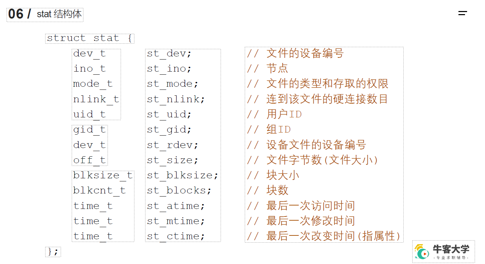

这里面有一个st_mode变量，他的结构如下


st_mode变量的作用就是记录文件的类型及存取的权限
>文件的类型用后面四位（12-15）存储，
可以使用一个16位数来判断该文件是否属于某种类型
在stat.h文件中记录了对应的宏
如S_IFSOCK的值为0140000(八进制数),对应的二进制数为1100 0000 0000 0000
S_IFMT：掩码，0170000，（1111 0000 0000 0000）
```
if(st_mode & S_IFMT == S_IFSOCK) {
    ...
}
```
总之 ：st_mode 掩码 宏 来判断文件类型和文件权限

示例程序：
```c

#include <sys/types.h>
#include <sys/stat.h>
#include <unistd.h>
#include<stdio.h>
int main() {
    struct stat statbuf;
    int ret = stat("a.txt", &statbuf);
    if(ret == -1) {
        perror("stat");
        return -1;
    }
    printf("size:%d\n",statbuf.st_size);
   
    return 0;
}
```

##### 小案例：模拟实现类似ls -l
**几个主要部分**

**获取输入的参数**

argc 是 argument count的缩写，表示传入main函数的参数个数；
argv 是 argument vector的缩写，表示传入main函数的参数序列或指针，并且第一个参数argv[0]一定是程序的名称，并且包含了程序所在的完整路径，所以确切的说需要我们输入的main函数的参数个数应该是argc-1个；
**判断输入的参数是否正确**
输入的参数全部保存在argv[]数组中，默认argv[0]是程序的名字，后面的参数依次为argv[1]、argv[2]、argv[3]...,
保证输入的参数有源文件的路径（如果是同一目录下，可以只写文件名）
```
// 判断输入的参数是否正确
    if(argc < 2) {
        printf("%s filename\n", argv[0]);
        return -1;
    }
```
**通过stat函数获取用户传入的文件的信息**
```
// 通过stat函数获取用户传入的  文件的信息
    struct stat st;
    int ret = stat(argv[1], &st);
    if(ret == -1) {
        perror("stat");
        return -1;
    }
```
**文件类型及文件权限**
```c
// 获取文件类型和文件权限
    char perms[11] = {0};   // 用于保存文件类型和文件权限的字符串
    switch(st.st_mode & S_IFMT) {
        case S_IFLNK:
            perms[0] = 'l';
            break;
        case S_IFDIR:
            perms[0] = 'd';
            break;
        case S_IFREG:
            perms[0] = '-';
            break;
        case S_IFBLK:
            perms[0] = 'b';
            break;
        case S_IFCHR:
            perms[0] = 'c';
            break;
        case S_IFSOCK:
            perms[0] = 's';
            break;
        case S_IFIFO:
            perms[0] = 'p';
            break;
        default:
            perms[0] = '?';
            break;
    }
    // 判断文件的访问权限
    // 文件所有者
    perms[1] = (st.st_mode & S_IRUSR) ? 'r' : '-';
    perms[2] = (st.st_mode & S_IWUSR) ? 'w' : '-';
    perms[3] = (st.st_mode & S_IXUSR) ? 'x' : '-';
    // 文件所在组
    perms[4] = (st.st_mode & S_IRGRP) ? 'r' : '-';
    perms[5] = (st.st_mode & S_IWGRP) ? 'w' : '-';
    perms[6] = (st.st_mode & S_IXGRP) ? 'x' : '-';
    // 其他人
    perms[7] = (st.st_mode & S_IROTH) ? 'r' : '-';
    perms[8] = (st.st_mode & S_IWOTH) ? 'w' : '-';
    perms[9] = (st.st_mode & S_IXOTH) ? 'x' : '-';
```
**硬连接数**
```c
int linkNum = st.st_nlink;
```
**文件所有者**
```c
// 文件所有者
    char * fileUser = getpwuid(st.st_uid)->pw_name;
```
**文件所在组**
```c
// 文件所在组
    char * fileGrp = getgrgid(st.st_gid)->gr_name;
```
**文件大小**
```c
long int fileSize = st.st_size;
```
**文件修改时间**
```c
// 获取修改的时间
    char * time = ctime(&st.st_mtime);
    char mtime[512] = {0};
    strncpy(mtime, time, strlen(time) - 1);
```
**汇总**
```c
//汇总
    char buf[1024];
    sprintf(buf, "%s %d %s %s %ld %s %s", perms, linkNum, fileUser, fileGrp, fileSize, mtime, argv[1]);
   
```
**输出**
```c
//输出
    printf("%s\n", buf);
```

* * *

#### 4.4.2 文件属性（大小、权限）操作函数
`access
`
```
#include <unistd.h>
int access(const char *pathname, int mode);
作用：判断某个文件是否由某种权限，或者文件是否存在
参数：
    path：文件路径
    mode：权限（宏）
        R_OK 当前进程是否由读权限
        W_OK
        X_OK
        F_OK(存在)
返回值：
    0：成功
    -1：失败
```
`
chmod
`
```
#include <sys/stat.h>
int chmod(const char *pathname, mode_t mode);
作用：修改文件权限
参数
    - path：文件路径
    - mode 需要修改的权限值、八进制数
返回值:
    0:成功
    -1：失败
```
`
truncate
`t
runcate是截短的意思
```
#include <unistd.h>
#include <sys/types.h>
int truncate(const char *path, off_t length);
作用：修改文件尺寸
参数：
    - path 文件路径
    - length 修改后的文件大小
返回值：
    0：成功
    -1：失败
```
#### 4.4.3 目录操作函数
`
chdir函数
`
```
#include <unistd.h>
int chdir(const char *path);    
作用：修改进程的工作目录
    比如在Linux/lesson14下启动一个可执行程序 a.out,则该可执行程序的工作目录就是Linux/lesson14
参数：path:
    修改后的工作目录
返回值：
 #include <unistd.h>
```
`
getcwd函数
`
```
cwd:（current work directory)
char *getcwd(char *buf, size_t size);
作用：获取当前的工作目录
参数：buf：
        获取目录后存储的缓存
    size ：数组的大小
返回值：
    返回一个指针，指针指向buf缓存。
```

##### 小案例.修改工作目录并创建文件
```c
#include <unistd.h>
#include <stdio.h>
#include <sys/stat.h>
#include <sys/types.h>
#include <fcntl.h>

int main() {
    //获取当前工作目录
    char buf[128] = {0};
    getcwd(buf, sizeof(buf));
    printf("当前工作目录：%s\n",buf);
    //修改工作目录
    int ret = chdir("./testChdir");
    if(ret == -1) {
        perror("chdir");
        return -1;
    }
    //创建一个文件
    int fd = open("testChdir.txt",O_RDWR | O_CREAT, 0664);
    if(fd == -1) {
        perror("open");
    }
    close(fd);
    //获取当前工作目录
    char buf1[128] = {0};
    getcwd(buf1, sizeof(buf));
    printf("当前工作目录：%s\n",buf1);
     return 0;
}

```

`
readdir
`
```c
#include <dirent.h>
struct dirent *readdir(DIR *dirp);
作用：返回指针，指向drip代表的目录流的下一个条目
参数：
    - dirp ：目录流指针
返回值：
    成功：dirent结构体指针。
    NULL：读到目录流的结尾，errno不变
    NULL：出错，errno变化。
```
`
closedir
`
```c
#include <sys/types.h>
#include <dirent.h>
int closedir(DIR *dirp);
作用：关闭目录流
参数：
    - dirp：目录流指针
返回值：
    0:成功
    -1：失败，同时，errno也会变化。
```
##### 案例.实现一个计算目录下普通文件数量的程序
```c
#include <sys/types.h>
#include <dirent.h>
#include <stdio.h>
#include <string.h>
#include <stdlib.h>
//声明
int getFileNum(const char * path);
//因为该程序是为了计算某个目录下的文件数量
//所以参数必须要有一个目录
int main(int argc, char * argv[]) {
   
    //要返回的结果
    int count = 0;
    //判断是否有文件路径
    if(argc < 2) {
        printf("plase input the name of director");
    }
   
    //获取普通文件数量
    count = getFileNum(argv[1]);
   
    printf("普通文件的个数为：%d\n", count);
    return 0;
}
int getFileNum(const char * path) {
   
    //文件数目
    int count = 0;
    //打开目录
    DIR * dir = opendir(path);
    if(dir == NULL) {
        perror("opendir");
        exit(0);
    }
    //读取目录
    struct dirent * dirEnt;
    while((dirEnt = readdir(dir)) != NULL) {
        //忽略. 和 ..
        char * dname = dirEnt->d_name;
        if(strcmp(dname,".") == 0 || strcmp(dname, "..") == 0) {
            continue;
        }
        //普通文件
        if(dirEnt->d_type == DT_REG) {
            count++;
        }
        //目录
        if(dirEnt->d_type == DT_DIR) {
            char newPath[1024];
            sprintf(newPath,"%s/%s",path,dname);
            count += getFileNum(newPath);
        }
    }
   
     //关闭目录流
    closedir(dir);
    return count;
}
```
#### 4.4.4文件描述符操作函数
`dup函数
`
```c
dup是duplicate（复制）的缩写

```

```c
#include <unistd.h>
int dup(int oldfd);
作用：复制文件描述符，在PCB控制块——>文件描述符表中新建一个文件描述符，其值和oldfd一致，即，新的文件描述符指向和oldfd一致的文件。
参数：- oldfd
        文件描述符
返回值：
    新的文件描述符
    -1：失败，errno
```
##### 小练习-复制文件描述符
```c
#include <unistd.h>
#include <stdio.h>
#include <sys/stat.h>
#include <sys/types.h>
#include <fcntl.h>
#include <string.h>
int main() {
    //新建文件,获取文件描述符
    int fd = open("a.txt", O_RDWR | O_CREAT, 0664);
    if(fd == -1) {
        perror("open");
        return -1;
    }
    //复制文件描述符
    int fd1 = dup(fd);
    //验证复制出来的文件描述符是否生效：用fd1写文件。
    char * buf = "hello,world";
    int ret = write(fd1, buf, strlen(buf));
    if(ret == -1) {
        perror("write");
        return -1;
    }
    printf("fd: %d, fd1: %d\n", fd, fd1);
    return 0;
}
```
`
dup2函数
`
```c
#include <unistd.h>
int dup2(int oldfd, int newfd);
作用：文件描述符newfd重定向，复制oldfd的值，即：newfd指向oldfd指向的文件
参数：  oldfd 目标文件描述符
        newfd 源文件描述符
返回值：
        新文件描述符
        -1，errno
```
##### 小练习-文件描述符重定向
```c
#include <stdio.h>
#include <unistd.h>
#include <fcntl.h>
#include <sys/types.h>
#include <sys/stat.h>
#include <string.h>
int main() {
    //创建一个文件，获取文件描述符fd
    int fd = open("1.txt", O_RDWR | O_CREAT,0644);
    if(fd == -1) {
        perror("open");
        return -1;//exit(0);
    }
   
    //再创建一个文件，获取文件描述符fd1
    int fd1 = open("2.txt", O_RDWR | O_CREAT,0644);
    if(fd1 == -1) {
        perror("open");
        return -1;//exit(0);
    }
   
    //打印fd, fd1
    printf("fd: %d, fd1: %d\n", fd, fd1);
   
    //文件描述符重定向fd1->fd，返回fd2
    int fd2 = dup2(fd, fd1);
    if(fd2 == -1) {
        perror("dup");
        return -1;
    }
   
    //修改fd1指向的文件
    char * buf = "hello,dup2";
    int len = write(fd1, buf, strlen(buf));
   
    //打印fd, fd1, fd2
    printf("fd: %d, fd1: %d, fd2: %d\n", fd, fd1,fd2);
   
    //关闭fd,fd1,fd2
    close(fd);
    close(fd1);
   
    return 0;
}
```
`fcntl函数
`

```c
#include <unistd.h>
#include <fcntl.h>
int fcntl(int fd, int cmd, ... /* arg */ );
作用：修改文件描述符
参数：
    - fd：需要进行操作的文件描述符
    - cmd：指定要对文件描述符执行什么样的操作
        F_DUPFD:复制文件描述符，得到一个新的文件描述符，相当于dup(int fd)
       
        F_GETFL:获取指定的文件状态flag，和创建（open）文件时指定的flag一致。
        F_SETFL:设置指定的文件描述符的状态flag
        必选项：O_RDONLY,O_WRONLY,O_RDWR(不可被修改)
        可选项：O_APPEND（追加数据）
    ... :针对某种操作，可能需要一些参数
示例：
    fcntl(int fd, int F_SETFL , flag );
```


##### 小案例-修改文件，在文末添加内容
```c

#include <stdio.h>
#include <sys/types.h>
#include <sys/stat.h>
#include <string.h>
#include <fcntl.h>
#include <unistd.h>
int main() {
    //打开一个文件，获取文件描述符
    int fd = open("./1.txt", O_RDWR);
    if(fd == -1) {
        perror("open");
        return -1;
    }
    //读取文件描述符的权限
    int flag = fcntl(fd, F_GETFL);
    if(flag == -1) {
        perror("fcntl");
        return -1;
    }
    //修改文件描述符的权限
    flag = flag | O_APPEND;
    int flag2 = fcntl(fd, F_SETFL, flag);
    if(flag2 == -1) {
        perror("fcntl2");
        return -1;
    }
   
    //写入数据
    char * buf = ",world!\n";
    write(fd, buf, strlen(buf));
    printf("fd: %d, flag: %d, flag2: %d\n", fd, flag, flag2);
    return 0;
}
```


