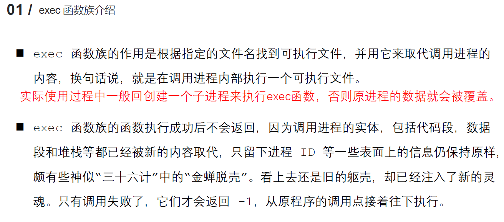
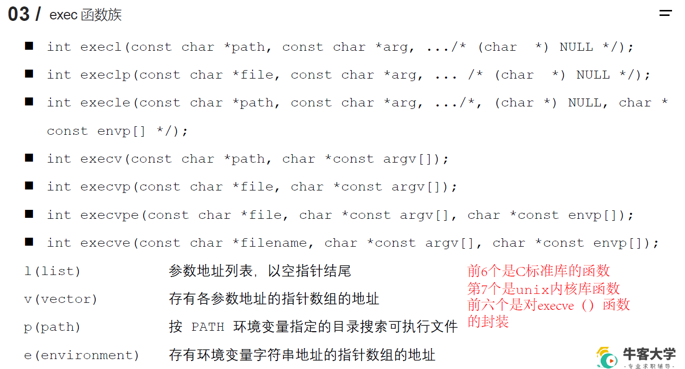

## 2.3 exec函数族
`exec函数族的作用`
>在进程中调用另外一个可执行文件

`exec函数族的特点`
>调用exec函数的进程中用户态的数据会被可执行文件中的数据替换，只留下ID灯数据不会被替换


`exec函数族包括的函数有哪些`



`exec函数族的命名特点`

- l : 参数以列表形式填充，以NULL结尾
- v : 参数以数组（向量）形式填充

- p ：在path环境变量指定的目录下搜索文件名（filename）

- e : 在envp[]数组中的元素（路径目录）下搜索文件名为filename的文件

`常用exec函数介绍`
```c
#include <unistd.h>
int execl(const char *pathname, const char *arg, ...)
参数：  - pathname:要执行的可执行文件的路径（推荐使用绝对路径）
        - arg：执行可执行程序所需要的参数，可以是多个。
        第一个参数一般是可执行程序的名字。
        从第二个参数开始才是参数列表，
        最后一个参数需要为NULL，表示输入参数结束
返回值：-1：出错时返回，errno被设置。
```

```c
#include <unistd.h>
int execl(const char *file, const char *arg, ...)
作用：到环境变量中根据可执行文件的名字**file**寻找可执行文件，找到了就执行，找不到就执行失败。
参数：  - file:要执行的可执行文件的文件名
        - arg：执行可执行程序所需要的参数，可以是多个。
        第一个参数一般是可执行程序的名字。
        从第二个参数开始才是参数列表，
        最后一个参数需要为NULL，表示输入参数结束
返回值：-1：出错时返回，errno被设置。
```