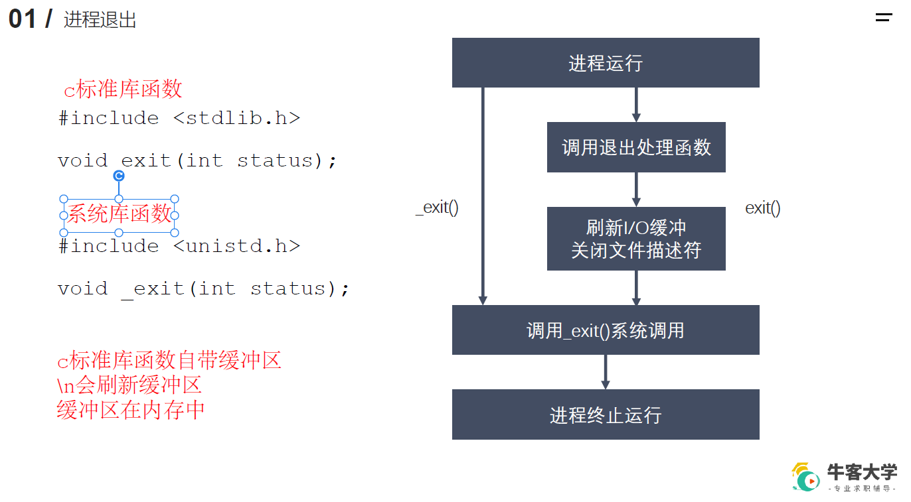
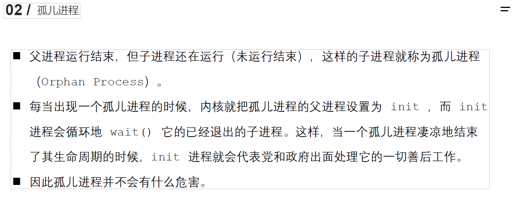
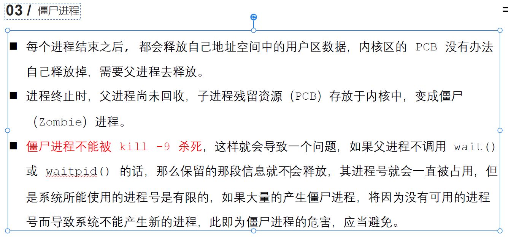
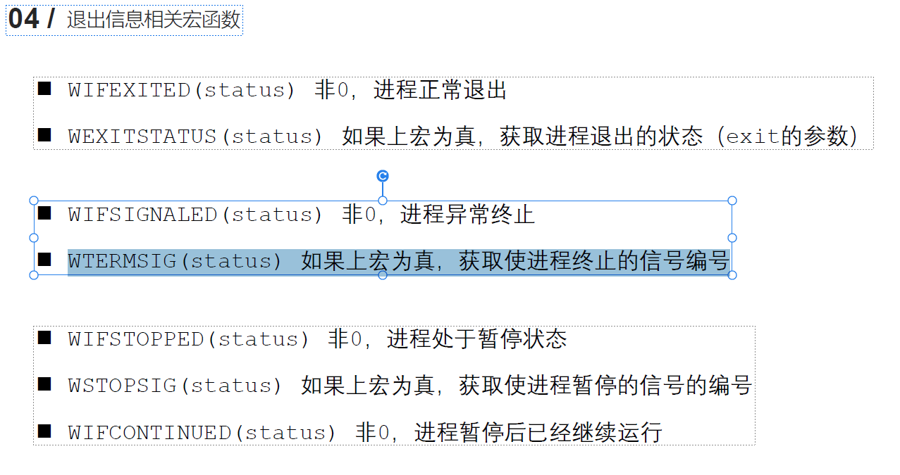

## 2.4 进程控制
`退出进程`

有两个负责退出进程的函数,一个在C标准库，一个在系统标准库，其中exit()函数是对_exit()函数的封装。增加的IO缓存刷新等。



`孤儿进程`

父进程退出的子进程，称为孤儿进程，操作系统会指定init进程为孤儿进程的子进程



`僵尸进程`

子进程已经退出，会自己释放用户区的数据，但是内核区的如PCB的数据需要父进程使用wait()来释放，父进程还没有结束，此时的子进程就会成为僵尸进程。



可以从shell的ps aux 命令查看进程的状态为：

zombie(僵尸)


`wait函数`

wait()函数等待子进程的结束

```c
#include <sys/types.h>
#include <sys/wait.h>

pid_t wait(int *wstatus);
 - 作用：等待子进程退出，如果子进程退出，wait会立即收到一个状态值，wait()会回收子进程的资源，如果有子进程未退出，父进程会阻塞在wait()函数处。
  - 参数：wstatus：是一个用于接收退出状态的int指针，父进程可以根据子进程的退出状态做出相应的操作
 - 返回值：
    - 成功：被回收的子进程的id
    - 失败：-1
    - 所有子进程回收完毕：-1

```
`
关于wait函数的manual手册的描述(机翻)
`

所有这些系统调用都用于等待调用进程的子进程的状态更改，并获取有关状态已更改的子进程的信息。 状态变化被认为是：孩子终止； 孩子被信号拦住； 或者孩子被一个信号恢复了。 在孩子终止的情况下，执行等待允许系统释放与孩子相关的资源； 如果未执行等待，则终止的子进程保持在“僵尸”状态（参见下面的注释）。
如果一个孩子已经改变了状态，那么这些调用会立即返回。 否则，它们会一直阻塞，直到子改变状态或信号处理程序中断调用（假设系统调用不会使用 sigaction(2) 的 SA_RESTART 标志自动重新启动）。 在本页的其余部分中，状态已更改且尚未被这些系统调用之一等待的子节点称为可等待的。


`进程退出信息相关宏函数`

以下宏函数可以根据wait()传出的status状态值判断子进程退出原因
- WIFEXITED(status) 若非0，说明子进程正常退出
- WIFSIGNALED(status) 非0，进程异常终止
- WIFSTOPPED(status) 非0，进程处于暂停状态
- WTERMSIG(status) 如果上宏为真，获取使进程终止的信号编号



`waitpid函数`
```c
#include <sys/types.h>
#include <sys/wait.h>

pid_t waitpid(pid_t pid, int *wstatus, int options);
 - 作用：等待子进程退出，如果子进程退出，wait会立即收到一个状态值，waitpid()会回收子进程的资源，可以设置是否父进程阻塞。
  - 参数：
    pid:
        > 0: 要回收的子进程的id
        = 0：回收当前进程组的子进程。
        = -1：回收所有子进程，相当于wait()
        < -1:某个进程组的组id的绝对值，回收某个进程组下的所有子进程。
    wstatus：是一个用于接收退出状态的**int指针**，父进程可以根据子进程的退出状态做出相应的操作
    options：设置阻塞或者非阻塞
    - 0 ：阻塞
    HNOHANG：非阻塞
 - 返回值：
    - > 0:成功，返回被回收的子进程的id
    - = 0：（option = 0时才可能返回），
    - -1：没有子进程了或者错误

```

