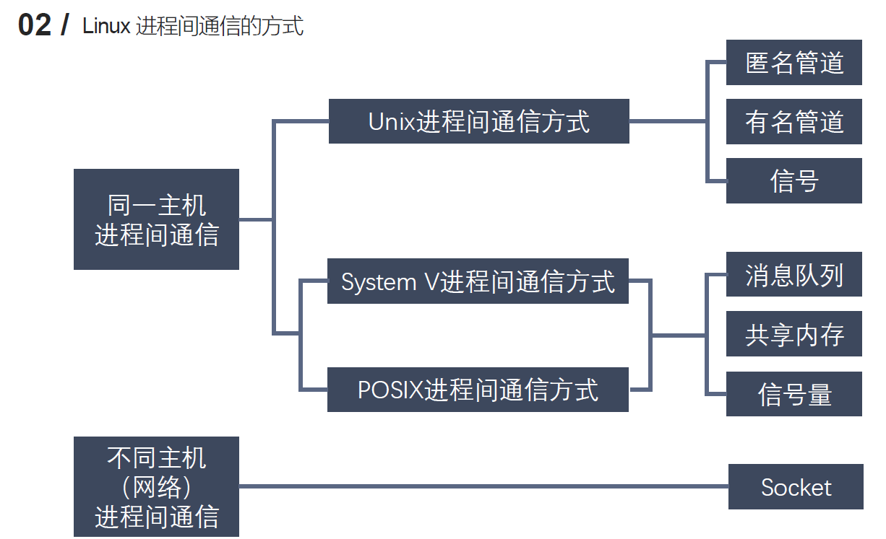
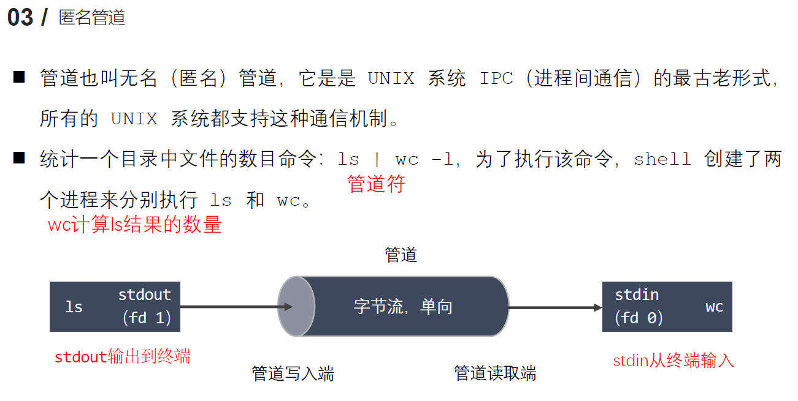
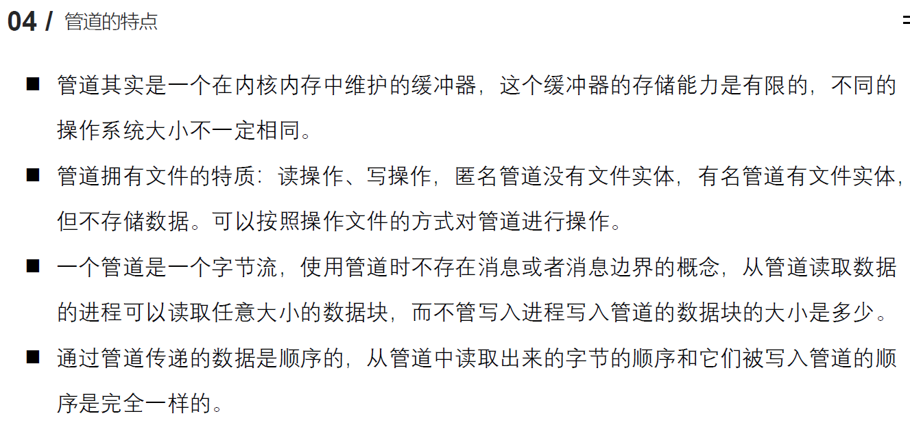
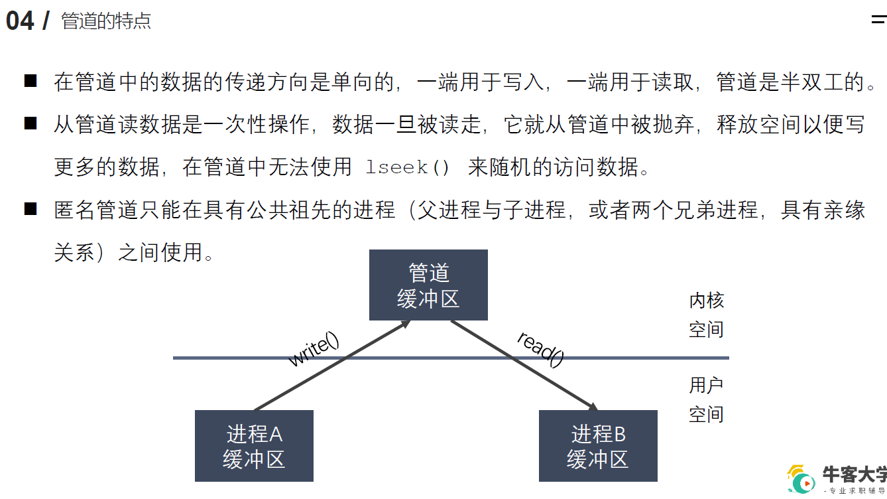
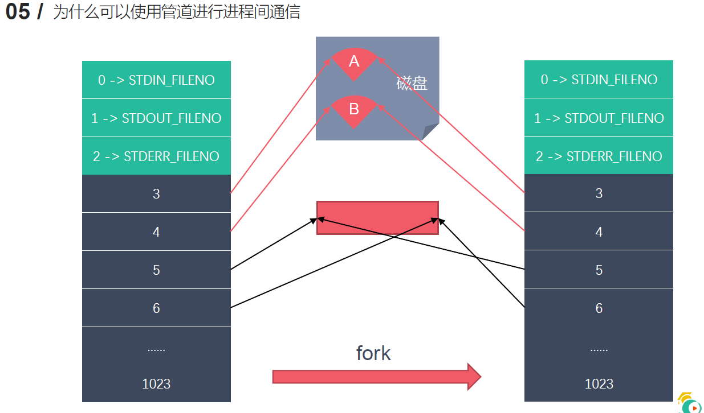
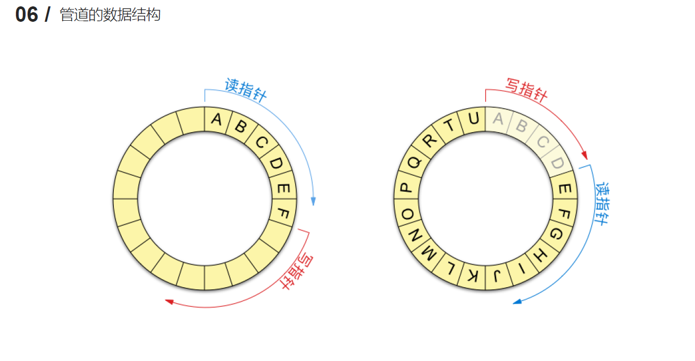
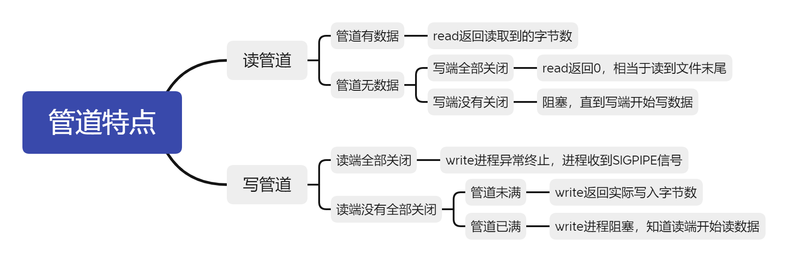

## 2.5 进程间通信
### 2.5.1 进程间通信简介

`什么是进程间通信`

进程之间相互发送和接收数据

`进程间通信的目的`

- 数据传输
- 通知事件：下载完之后有弹窗
- 资源共享：两个窗口可以打开同一个文件夹、文件
- 进程控制：如DEBUG、资源管理器结束某个程序的进程

`进程间通信的方式`



### 2.5.2 匿名管道
`匿名管道的介绍`



`匿名管道的特点`





`使用匿名管道实现进程间通信的原理`



`管道的数据结构`



`匿名管道的使用`

```c
#include <unistd.h>
int pipe(int pipefd[2]);

作用：创建一个（匿名）管道文件
参数：pipefd[]是一个数组，执行之后会把数据存到这个数组中
    pipefd[0]:读端fd文件描述符
    pipefd[1]:写端fd文件描述符
返回值：
    0：成功
    -1：失败
注意：
- pipe()只能用于有关系的两个进程，父子进程、兄弟进程、兄弟进程
- 如果pipe里面没有数据，read操作回被阻塞。

```
`案例模拟实现ps aux`
```c
/*
    实现 ps aux | grep xxx 父子进程间通信
    
    子进程： ps aux, 子进程结束后，将数据发送给父进程
    父进程：获取到数据，过滤
    pipe()
    execlp()
    子进程将标准输出 stdout_fileno 重定向到管道的写端。  dup2
*/

#include <unistd.h>
#include <sys/types.h>
#include <stdio.h>
#include <stdlib.h>
#include <string.h>
#include <wait.h>

int main() {

    // 创建一个管道
    int fd[2];
    int ret = pipe(fd);

    if(ret == -1) {
        perror("pipe");
        exit(0);
    }

    // 创建子进程
    pid_t pid = fork();

    if(pid > 0) {
        // 父进程
        // 关闭写端
        close(fd[1]);
        // 从管道中读取
        char buf[1024] = {0};

        int len = -1;
        while((len = read(fd[0], buf, sizeof(buf) - 1)) > 0) {
            // 过滤数据输出
            printf("%s", buf);
            memset(buf, 0, 1024);
        }

        wait(NULL);

    } else if(pid == 0) {
        // 子进程
        // 关闭读端
        close(fd[0]);

        // 文件描述符的重定向 stdout_fileno -> fd[1]
        dup2(fd[1], STDOUT_FILENO);
        // 执行 ps aux
        execlp("ps", "ps", "aux", NULL);
        perror("execlp");
        exit(0);
    } else {
        perror("fork");
        exit(0);
    }


    return 0;
}

```
`管道的读写特点及设置管道非阻塞`

使用管道是，需要注意以下几种特殊情况
- 所有指向管道写段的文件描述符都是关闭的（写端引用计数为0），有进程从读端读数据，read结束之后，read返回管道中的数据，再次read，返回0，就像读到文件末尾一样。
- 如果有指向管道写端的文件描述符没有关闭，（写端引用计数>0）,写端进程并没有写数据，写端read之后，再次read，会被阻塞，直到管道里面有数据。
- 所有指向读端的文件描述符是关闭的（读端文件描述符 = 0），有进程在写端写数据，该进程回收到一个信号SIGPIPE，通常会导致管道异常终止。
- 读端存在文件描述符没有关闭（读端引用计数 > 0）,持有管道读端文件描述符的进程没有读数据，写端向管道写数据写满之后再次write，write进程会被阻塞，直到读端文件描述符的进程开始读数据。



`设置管道非阻塞

```c
//设置读端为非阻塞状态
int flags = fcntl(pipefd[0],F_GETFL);
flags = flags | O_NONBLOCK;
fcntl(pipefd[0], F_SETFL, flags);
```


### 2.5.2 有名管道

`有名管道介绍`

-	匿名管道，由于没有名字，只能用于**亲缘关系**的进程间通信。为了克服这个缺点，提出了有名管道（FIFO），也叫命名管道、FIFO文件。
-	有名管道（FIFO）不同于匿名管道之处在于它提供了一个路径名与之关联，以 FIFO的文件形式存在于文件系统中，并且其打开方式与打开一个普通文件是一样的，这样即使与 FIFO 的创建进程不存在亲缘关系的进程，只要可以访问该路径，就能够彼此通过 FIFO 相互通信，因此，通过 FIFO 不相关的进程也能交换数据。
-	一旦打开了 FIFO，就能在它上面使用与操作匿名管道和其他文件的系统调用一样的I/O系统调用了（如read()、write()和close()）。与管道一样，FIFO 也有一个**写入端**和**读取端**，并且从管道中读取数据的顺序与写入的顺序是一样的。FIFO 的名称也由此而来：（First In First Out）先入先出。
- 	有名管道（FIFO)和匿名管道（pipe）有一些特点是相同的，不一样的地方在于：
  - - 1.	FIFO 在文件系统中作为一个特殊文件存在，但 FIFO 中的内容却存放在内存中。
- -  2. 当使用 FIFO 的进程退出后，FIFO 文件将继续保存在文件系统中以便以后使用。
- - 3.	FIFO 有名字，不相关的进程可以通过打开有名管道进行通信。

`有名管道的使用`

创建
    代码创建：makefifo
使用
    read、
